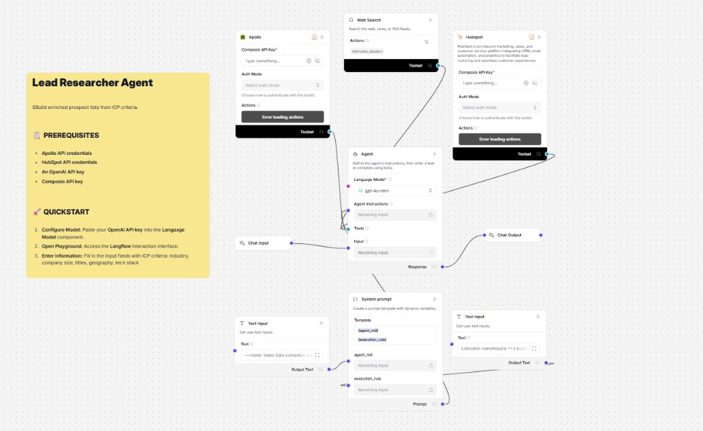

# Lead Researcher Agent

> Open-source web UI for the **Lead Researcher Agent** — powered by [UPLIZD](https://uplizd.ai). The hosted flow builds enriched prospect lists from ICP criteria using **Apollo** (Composio), **Web Search** (`PERFORM_SEARCH`), and **HubSpot** (Composio), with **gpt-4o-mini** and a composable system prompt (`agent_md` + `execution_rule`).

[](https://uplizd.ai/marketplace/lead-researcher-agent)



---

## How it works

This repository is the **web UI + local proxy** only. Tool logic (Apollo, HubSpot, web search, agent prompt assembly) runs inside your **UPLIZD** flow after you install it from the Marketplace and connect credentials there.

```
You (browser)  →  this web UI  →  Express proxy  →  UPLIZD run API  →  Lead Researcher flow
```

---

## Flow logic (parity with Langflow canvas)

| Piece | Role |
|-------|------|
| **Chat Input** | User message = ICP / research instructions |
| **Language Model** | `gpt-4o-mini` |
| **System Prompt** | Template with `{agent_md}` + `{execution_rule}` |
| **Apollo** (Composio) | Lead / company discovery from ICP |
| **Web Search** | `PERFORM_SEARCH` for open-web context |
| **HubSpot** (Composio) | CRM objects, lists, or enrichment (per your node config) |
| **Chat Output** | Structured prospect list / research brief |

> Configure **OpenAI**, **Composio**, **Apollo**, and **HubSpot** keys in the UPLIZD flow (not in this repo). The proxy only stores `UPLIZD_API_KEY` + `UPLIZD_FLOW_ID`.

---

## Features

- **Chat playground** — same interaction model as the flow’s Chat Input
- **UPLIZD backend** — all integrations live in the flow
- **Secure proxy** — UPLIZD API key never sent to the browser
- **Quick prompts** — ICP-oriented one-shots aligned with the yellow “Quickstart” note
- **Dark mode** — follows system preference
- **Session ID** — each “New session” gets a fresh `session_id` for the run API

---

## Stack

| Layer | Tech |
|-------|------|
| Frontend | React 18 + Vite |
| Proxy | Express (Node.js) |
| AI workflow | UPLIZD Marketplace |

---

## Prerequisites

- Node.js ≥ 18
- UPLIZD account + API key
- Marketplace flow **Lead Researcher Agent** installed (when available), with tools authorized in-studio

---

## Quick start

### 1 — Install the flow from Marketplace

**[→ Lead Researcher Agent on UPLIZD Marketplace](https://uplizd.ai/marketplace/lead-researcher-agent)**

1. Click **Install**
2. Open the flow → copy **Flow ID** from the URL (`…/flow/YOUR_FLOW_ID`)
3. **Settings → API Keys** → copy your key
4. In the flow editor: paste **OpenAI** key into the Language Model node, **Composio** key into Apollo / HubSpot toolsets, and complete Composio auth for each toolkit

### 2 — Clone & configure

```bash
git clone https://github.com/uplizd/lead-researcher-agent.git
cd lead-researcher-agent
cp .env.example .env
```

Edit `.env`:

```bash
UPLIZD_API_KEY=your_api_key_here
UPLIZD_FLOW_ID=your_flow_id_here
```

### 3 — Run

```bash
npm run install:all
npm run dev
```

Open **http://localhost:5173**

---

## Environment variables

| Variable | Required | Description |
|----------|----------|-------------|
| `UPLIZD_API_KEY` | ✅ | UPLIZD API key |
| `UPLIZD_FLOW_ID` | ✅ | Flow ID after Marketplace install |
| `UPLIZD_BASE_URL` | — | Default: `https://studio.uplizd.ai` |
| `PORT` | — | Proxy port (default `3001`) |
| `CORS_ORIGIN` | — | Default `http://localhost:5173` |
| `FLOW_INPUT_TYPE` | — | Default `chat` |
| `FLOW_OUTPUT_TYPE` | — | Default `chat` |

---

## Project structure

```
lead-researcher-agent/
├── .env.example
├── package.json
├── server/index.js          # Proxy → UPLIZD /api/v1/run/:flowId
├── web/                     # Vite + React UI
└── docs/
    ├── workflow.png         # Reference canvas screenshot
    ├── setup.md
    └── contributing.md
```

---

## Contributing

See [docs/contributing.md](docs/contributing.md).

---

## License

MIT — see [LICENSE](LICENSE).
